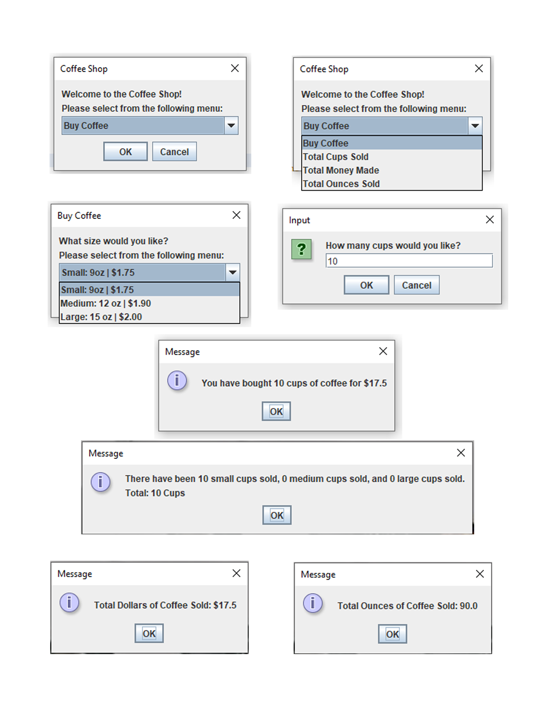
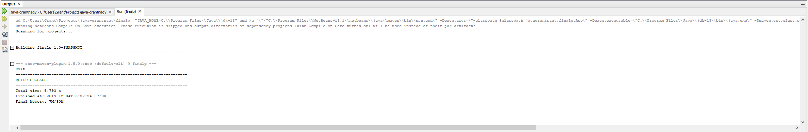

### Final Project
- This program is an electronic coffee shop completely operated in a GUI utilizing swing.JOptionPane. 
- You can pretend purchase small, medium, or large coffee. 
- You can see the total amounts of coffee sold in dollars, ounces, and cups.
Screenshots of the various gui are shown below.

  

